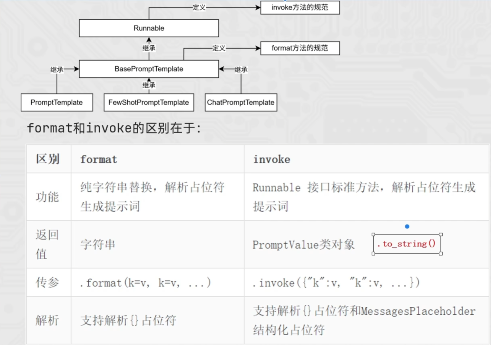
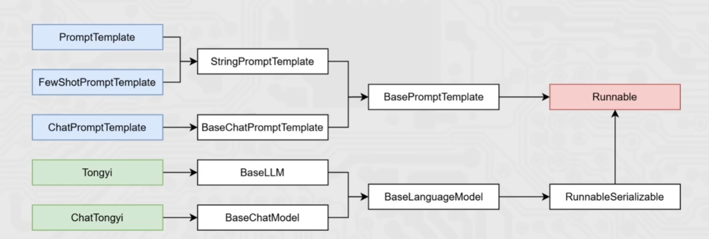

# LangChain

## 1. 简介

LangChain 是一款**面向大语言模型（LLM）业务开发的 Python 第三方库**，核心定位是 “LLM 业务功能集大成者”，通过封装标准化 API，降低 LLM 应用开发的复杂度，提供一站式的功能集成与流程编排能力。

提供的功能：提示词优化、模型调用（支持各种模型）、会话记忆、文档管理分析、Agent 智能体构建、链式执行。

## 2. 安装对应的包

```python
pip install langchain langchain-community langchain-ollama dashscope chromadb
pip install -i https://pypi.tuna.tsinghua.edu.cn/simple langchain langchain-community langchain-ollama dashscope chromadb # 添加国镜像源下载更快。
```

- **langchain**：LangChain 核心基础包，提供Chain、提示词、记忆、Agent等核心功能 ;

- **langchain-community**：社区扩展包，集成第三方大模型、向量库、工具组件; 
- **langchain-ollama**：专门对接本地Ollama模型，支持离线调用开源大模型 
- **dashscope**：阿里云通义千问官方SDK，用于调用千问大模型 
- **chromadb**：轻量嵌入式向量数据库，用于RAG场景存储和检索文本向量

## 3. LangChain支持的模型

LangChain 最大的价值在于**屏蔽底层模型差异**，提供一个**精简的统一接口**。无论市面上有多少模型（如通义千问、GPT、Claude 等），开发者只需遵循这套接口标准，就能轻松实现模型的无缝切换。

1. 大语言模型（LLMs）：核心是文本生成，基于 Transformer 架构训练，用于理解和生成自然语言，服务于文本创作、摘要等场景。

访问qwen：

```python
# langchain_community
from langchain_community.llms.tongyi import Tongyi

# 不用qwen3-max，因为qwen3-max是聊天模型，qwen-max是大语言模型
model = Tongyi(model="qwen-max")

# 调用invoke向模型提问
res = model.invoke(input="你是谁呀能做什么？")

print(res)
```

访问ollama：

```python
# langchain_ollama
from langchain_ollama import OllamaLLM

model = OllamaLLM(model="qwen3:4b")

res = model.invoke(input="你是谁呀能做什么？")

print(res)
```

流式输出：

```python
# langchain_ollama 流式输出
from langchain_ollama import OllamaLLM

model = OllamaLLM(model="qwen3:4b")

# 流式输出
for chunk in model.stream("你是谁呀能做什么？"):
    print(chunk, end="", flush=True)
```

2. 聊天模型（Chat Models）：专为对话场景优化的 LLMs，支持多轮交互，适配聊天机器人、Agent 等对话类业务场景。

聊天消息包含下面几种类型：

**AIMessage**：就是 AI 输出的消息，可以是针对问题的回答。（OpenAI 库中的 assistant 角色）

**HumanMessage**：人类消息就是用户信息，由人给出的信息发送给 LLMs 的提示信息，比如 “实现一个快速排序方法”。（OpenAI 库中的 user 角色）

**SystemMessage**：可以用于指定模型具体所处的环境和背景，如角色扮演等。你可以在这里给出具体的指示，比如 “作为一个代码专家”，或者 “返回 json 格式”。（OpenAI 库中的 system 角色）

```python
# chat_model
from langchain_community.chat_models.tongyi import ChatTongyi
from langchain_core.messages import HumanMessage, SystemMessage, AIMessage

# 初始化模型
chat = ChatTongyi(model="qwen3-max")

# 准备消息list
messages = [
    SystemMessage(content="你是一名来自边塞的诗人"),
    HumanMessage(content="给我写一首唐诗"),
    AIMessage(content="锄禾日当午，汗滴禾下土，谁知盘中餐，粒粒皆辛苦。"),
    HumanMessage(content="给予你上一首的格式，再来一首")
]

# 流式输出
for chunk in chat.stream(input=messages):
    print(chunk.content, end="", flush=True)
```

简化写法：

```python
from langchain_community.chat_models.tongyi import ChatTongyi

# 得到模型对象，qwen3-max就是聊天模型
model = ChatTongyi(model="qwen3-max")

# 准备消息列表（元组格式）
messages = [
    ("system", "你是一个边塞诗人。"),
    ("human", "写一首唐诗"),
    ("ai", "锄禾日当午，汗滴禾下土，谁知盘中餐，粒粒皆辛苦。"),
    ("human", "按照你上一个回复的格式，再写一首唐诗。")
]

# for循环迭代打印输出，通过.content来获取到内容
for chunk in model.stream(input=messages):
    print(chunk.content, end="", flush=True)
```

```python
from langchain_community.chat_models.tongyi import ChatTongyi

# 得到模型对象，qwen3-max就是聊天模型
model = ChatTongyi(model="qwen3-max")

# 准备消息列表（元组格式）
type = "边塞" # 可以支持变量嵌入
messages = [
    ("system", "你是一个边塞诗人。"),
    ("human", "写一首唐诗"),
    ("ai", "锄禾日当午，汗滴禾下土，谁知盘中餐，粒粒皆辛苦。"),
    ("human", "按照你上一个回复的格式，再写一首唐诗，关于{type}的。")
]

# for循环迭代打印输出，通过.content来获取到内容
for chunk in model.stream(input=messages):
    print(chunk.content, end="", flush=True)
```

3. 文本嵌入模型（Embeddings Models）：将文本转换为固定长度向量，用于语义相似度计算与检索，是 RAG 系统的核心基础组件。

```python
from langchain_community.embeddings import DashScopeEmbeddings

# 初始化嵌入模型对象，其默认使用模型是：text-embedding-v1
embed = DashScopeEmbeddings()

# 测试
print(embed.embed_query("我喜欢你"))
print(embed.embed_documents(['我喜欢你', '我稀饭你', '晚上吃啥']))
```

## 4. LangChain通用prompt

LangChain 核心提示词模板类PromptTemplate，用于定义可复用的提示词结构，支持动态变量注入，最终生成可用的提示词。

1. zero-short思想下，可以直接基于PromptTemolate完成。通用提示词模版，支持动态注入信息。

```python
# LangChain的提示词模版
from langchain_core.prompts import PromptTemplate
from langchain_community.llms.tongyi import Tongyi

# 构建提示词模板
prompt_template = PromptTemplate.from_template(
    "我的邻居姓{lastname}，刚生了{gender}，帮忙起名字，请简略回答。"
)

# 变量注入，生成提示词文本
prompt_text = prompt_template.format(lastname="张", gender="女儿")

# 创建模型对象
model = Tongyi(model="qwen-max")
# 调用模型获取结果
res = model.invoke(input=prompt_text)
print(res)
```

```python
# 构建提示词模板
prompt_template = PromptTemplate.from_template(
    "我的邻居姓{lastname}，刚生了{gender}，帮忙起名字，请简略回答。"
)

# 创建模型对象
model = Tongyi(model="qwen-max")
# 生成链：将模板与模型串联
chain = prompt_template | model # 管道，直接把左边的输出给右边的当输入

# 基于链，直接传入参数调用模型获取结果
res = chain.invoke(input={"lastname": "曹", "gender": "女儿"})
print(res)
```

2. FewShot思想下，需要更换为FewShotPromptTemplate，可以基于模版注入少量的示例信息。

```python
from langchain_core.prompts import FewShotPromptTemplate, PromptTemplate
from langchain_community.llms.tongyi import Tongyi
# 定义单个示例的模板
example_template = PromptTemplate.from_template("单词:{word}, 反义词:{antonym}")

# 示例数据：list 内套字典，用于给模型做Few-Shot学习
example_data = [
    {"word": "大", "antonym": "小"},
    {"word": "上", "antonym": "下"}
]

# 组装FewShotPromptTemplate对象
few_shot_prompt = FewShotPromptTemplate(
    example_prompt=example_template,  # 单个示例的渲染模板
    examples=example_data,            # 示例数据集
    prefix="给出给定词的反义词，有如下示例：",  # 示例前的引导语
    suffix="基于示例告诉我：{input_word}的反义词是？",  # 示例后的用户问题
    input_variables=['input_word']    # 最终需要传入的变量
)

# 调用模板，传入变量，生成最终提示词
prompt_text = few_shot_prompt.invoke(input={"input_word": "左"}).to_string()
print(prompt_text)

model = Tongyi(model="qwen-max")
res = model.invoke(input=prompt_text)
print(res)
```

3. format()和invoke()方法

`PromptTemplate`、`FewShotPromptTemplate`、`ChatPromptTemplate`都拥有`format`和`invoke`这 2 类方法。



4. ChatPromptTemplate的使用，支持注入任意数量的历史会话信息。

```python
from langchain_core.prompts import ChatPromptTemplate, MessagesPlaceholder
from langchain_community.chat_models.tongyi import ChatTongyi

# 构建对话式提示词模板
chat_prompt_template = ChatPromptTemplate.from_messages(
    [
        ("system", "你是一个边塞诗人，可以作诗。"),
        MessagesPlaceholder("history"),  # 对话历史占位符
        ("human", "请再来一首唐诗"),
    ]
)

# 对话历史数据：多轮 human/ai 对话
history_data = [
    ("human", "你来写一个唐诗"),
    ("ai", "床前明月光，疑是地上霜，举头望明月，低头思故乡"),
    ("human", "好诗再来一个"),
    ("ai", "锄禾日当午，汗滴禾下锄，谁知盘中餐，粒粒皆辛苦"),
]

# 注入对话历史，生成最终提示词
prompt_text = chat_prompt_template.invoke({"history": history_data}).to_string()

# 初始化通义千问对话模型
model = ChatTongyi(model="qwen3-max")

# 调用模型获取结果
res = model.invoke(prompt_text)

# 打印回答内容和类型
print(res.content, type(res))
```

## 5. chain链

1. **核心原理**：「将组件串联，上一个组件的输出作为下一个组件的输入」是 LangChain 链（尤其是 `|` 管道链，即 LCEL）的核心工作原理，也是链式调用的核心价值：实现数据的自动化流转与组件的协同工作。

**最简链示例**：

```
chain = prompt_template | model
```

**入链前提**：只有 `Runnable` 子类对象才能入链（`Callable`、`Mapping` 接口子类对象也可加入，后续了解用的不多）。



```python
# chain的使用
from langchain_core.prompts import ChatPromptTemplate, MessagesPlaceholder
from langchain_community.chat_models.tongyi import ChatTongyi

# 构建对话式提示词模板
chat_prompt_template = ChatPromptTemplate.from_messages(
    [
        ("system", "你是一个边塞诗人，可以作诗。"),
        MessagesPlaceholder("history"),  # 对话历史占位符
        ("human", "请再来一首唐诗"),
    ]
)

# 对话历史数据：多轮 human/ai 对话
history_data = [
    ("human", "你来写一个唐诗"),
    ("ai", "床前明月光，疑是地上霜，举头望明月，低头思故乡"),
    ("human", "好诗再来一个"),
    ("ai", "锄禾日当午，汗滴禾下锄，谁知盘中餐，粒粒皆辛苦"),
]

# 注入对话历史，生成最终提示词
prompt_text = chat_prompt_template.invoke({"history": history_data}).to_string()

# 初始化通义千问对话模型
model = ChatTongyi(model="qwen3-max")

# 普通写法
# res = model.invoke(prompt_text)
# print(res.content, type(res))
# 链式写法
chain = chat_prompt_template | model
# 通过链调用模型获取结果，通过invoke或stream方法获取结果
res = chain.invoke(input={"history": history_data})
print(res.content, type(res))
```

2. StrOutputParser 是 LangChain 中用于处理模型输出类型转换的核心解析器，本质是一个 字符串转换器。

```python
# StrOutputParser 是 LangChain 中用于处理模型输出类型转换的核心解析器，本质是一个 字符串转换器。
# 为了：将 AIMessage 转为字符串，解决  chain = prompt | model | model  报错的问题  ，使用llm模型不报错，但是使用chat会报错
# 拿着模型第一次回答的结果，继续去对模型进行一个追问
from langchain_core.output_parsers import StrOutputParser
from langchain_core.prompts import ChatPromptTemplate
from langchain_community.chat_models.tongyi import ChatTongyi

# 1. 定义模板
prompt = ChatPromptTemplate.from_template("介绍一下{topic}")

# 2. 定义模型
model = ChatTongyi(model="qwen-max")

# 3. 定义解析器（核心：将AIMessage转为字符串）
parser = StrOutputParser()

# 4. 构建管道链：模板 → 模型 → 解析器 → 后续处理
# 链的最终输出类型是 str，而不是 AIMessage
chain = prompt | model | parser | model  # 将第一次第二节结果转换成字符串，再次交给model

# 5. 调用
result = chain.invoke({"topic": "程序员"})
print(type(result))  # 输出: <class 'AiMessage'>
print(result.content)        # 输出: 程序员是从事...的专业人员
```

3. JsonOutputParser：将模型输出的 `AIMessage` 解析为 **标准 JSON 字典**，用于结构化数据提取。而StrOutputParser是将AiMessage转换为str。

chain = prompt | model | parser | model | parser，上一个模型的输出，**没有经过提示词模板的二次构建**，直接裸传给下一个模型，会造成模型输入无明确指令，输出不可控。

标准流程：invoke/stream 初始输入 → 提示词模板 → 模型 → 数据处理 → 提示词模板 → 模型 → 解析器 → 结果。

```python
from langchain_core.output_parsers import StrOutputParser
from langchain_core.output_parsers import JsonOutputParser
from langchain_core.prompts import PromptTemplate
from langchain_community.chat_models.tongyi import ChatTongyi

# 初始化解析器
str_parser = StrOutputParser()
json_parser = JsonOutputParser()

# 初始化通义千问模型
model = ChatTongyi(model="qwen3-max")

# 第一轮提示词模板：生成JSON格式的名字
first_prompt = PromptTemplate.from_template(
    "我邻居姓：{lastname}，刚生了{gender}，请起名，并封装到JSON格式返回给我，"
    "要求key是name，value就是起的名字。请严格遵守格式要求"
)

# 第二轮提示词模板：解析名字含义
first_prompt = PromptTemplate.from_template(
    "我邻居姓：{lastname}，刚生了{gender}，请起名，并封装到JSON格式返回给我，"
    "要求封装为json格式。key是name，value就是起的名字。请严格遵守格式要求"  # 这里要指定对应的要求，转换为key，value格式，便于后面的转换
)

# 构建完整LCEL链
chain = first_prompt | model | json_parser | second_prompt | model | str_parser

# 调用链并获取结果
res: str = chain.invoke({"lastname": "张", "gender": "女儿"})
print(res)
print(type(res))
```

4. RunnambeLambda：把**普通函数 / Lambda 匿名函数**，转换成符合 `Runnable` 接口的实例，让自定义逻辑可以无缝加入 LCEL 管道链（`|`）中。用来解决「内置解析器不够灵活，需要自定义数据处理逻辑」的问题，解决内置解析器（`JsonOutputParser`/`StrOutputParser`）不够灵活。

基础语法：RunnableLambda(函数对象 或 lambda 匿名函数)

自定义 Lambda 链：`first_prompt | model | RunnableLambda(自定义逻辑) | second_prompt | model | str_parser`

```python
from langchain_core.output_parsers import StrOutputParser
from langchain_core.runnables import RunnableLambda
from langchain_core.prompts import PromptTemplate
from langchain_community.chat_models.tongyi import ChatTongyi

# 初始化字符串解析器
str_parser = StrOutputParser()

# 自定义RunnableLambda：将模型返回的AIMessage转为字典，提取name字段
my_func = RunnableLambda(lambda ai_msg: {"name": ai_msg.content})

# 初始化通义千问模型
model = ChatTongyi(model="qwen3-max")

# 第一轮提示词模板：仅要求返回名字
first_prompt = PromptTemplate.from_template(
    "我邻居姓: {lastname}，刚生了{gender}，请起名，仅告知我名字，不要额外信息"
)

# 第二轮提示词模板：解析名字含义
second_prompt = PromptTemplate.from_template(
    "姓名{name}，请帮我解析含义。"
)

# 构建完整LCEL链
chain = first_prompt | model | my_func | second_prompt | model | str_parser

# 调用链并获取结果
res: str = chain.invoke({"lastname": "张", "gender": "女儿"})
print(res)
print(type(res))
```


4. 
