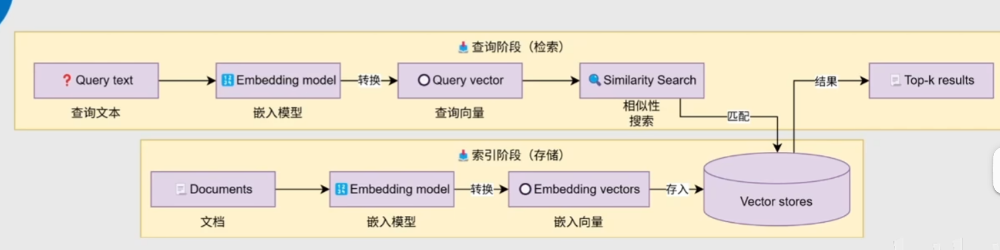
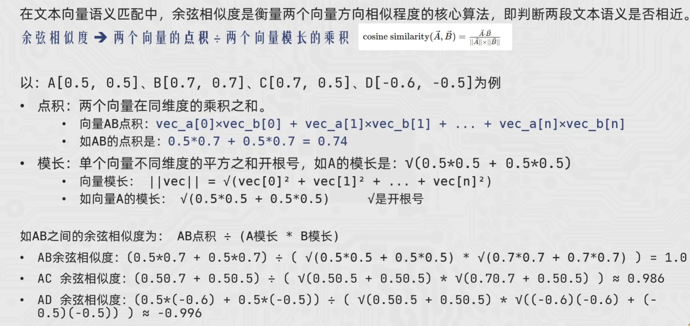

# RAG

## 1. 简介

为了解决大模型知识过时、领域知识缺失、幻觉问题，**RAG（Retrieval-Augmented Generation，检索增强生成）** 是一种大语言模型（LLM）增强技术，核心是**让大模型在生成回答前，先从外部知识库中检索相关信息，再基于检索到的内容生成回答**，本质公式为：**RAG = 检索技术 + LLM 提示**。

## 2. 工作流程

1.  索引阶段（Indexing）：离线构建知识库，将多源异构文档处理为可检索的向量，存入向量数据库，为后续检索做准备。
2.  检索阶段（Retriever）：在线匹配相关知识，将用户问题转为向量，从向量库中召回最相关的上下文。
3.  生成阶段（Generation）：基于上下文生成回答，用检索到的上下文增强 LLM 回答，解决幻觉、知识过时等问题。



## 3. 向量

### 1. 向量简介

向量是文本的语义数学表示，通过 Embedding 模型将文本转换为固定长度的数字列表，让计算机能通过相似度计算理解文本语义，是 RAG 技术中实现语义检索的核心基础。

原理略。可以直接使用**文本嵌入模型（Text Embedding Model）** 是一类通过深度学习技术，将自然语言文本的**语义特征**提取出来，并映射为一串 **固定长度的数字序列（向量） ** 的 AI 模型。可以在1536个维度上进行打分。比如 我喜欢小美。可以在3个纬度进行打分，分别是 情绪、动作、倾向。

生成的向量维度越多，就越能够记录文本的语义特征，匹配更精准，但是在存储和计算时的压力也就越大。

### 2. 余弦相似度

**余弦相似度**的核心作用：**撇除向量长度的影响，只计算两个向量在空间中的方向夹角**，夹角越小，代表语义越相似（方向越接近）。

#### 1. 一维向量示例

向量 `[-0.5]`、`[0.5]`、`[1]`：

- `[0.5]` 和 `[1]` 方向相同（都在正半轴），仅长度不同 → 余弦相似度 = 1，完全相似
- `[-0.5]` 方向相反 → 余弦相似度 = -1，完全不相似

#### 2. 二维向量示例

向量 `[0.5, 0.5]` 和 `[0.7, 0.7]`：

- 方向完全相同（都在 y=x 直线上），仅长度不同 → 余弦相似度 = 1，语义高度相似
- 向量 `[0.7, 0.5]` 方向偏移 → 相似度降低
- 向量 `[0.5, -0.5]` 方向垂直 → 相似度 = 0
- 向量 `[-0.5, -0.5]` 方向相反 → 相似度 = -1

n维类似

#### 3. 原理

余弦相似度越接近1，越相似。



## 4. 会话记忆

### 1. 临时记忆功能

如果想要封装历史记录，除了自行维护历史消息外，也可以借助 LangChain 内置的历史记录附加功能。

LangChain 提供了 History 功能，帮助模型在有历史记忆的情况下回答。

- 基于 RunnableWithMessageHistory 在原有链的基础上创建带有历史记录功能的新链（新 Runnable 实例）
- 基于 InMemoryChatMessageHistory 为历史记录提供内存存储（临时用）

```python
from langchain_community.chat_models.tongyi import ChatTongyi
from langchain_core.chat_history import InMemoryChatMessageHistory
from langchain_core.output_parsers import StrOutputParser
from langchain_core.prompts import PromptTemplate
from langchain_core.runnables.history import RunnableWithMessageHistory

def print_prompt(full_prompt):
    print("="*20, full_prompt.to_string(), "="*20)
    return full_prompt

model = ChatTongyi(model="qwen3-max")
prompt = PromptTemplate.from_template(
    "你需要根据对话历史回应用户问题。对话历史：{chat_history}。用户当前输入：{input}， 请给出回应"
)
base_chain = prompt | print_prompt | model | StrOutputParser()

chat_history_store = {}  # 存放多个会话ID所对应的历史会话记录
def get_history(session_id):
    if session_id not in chat_history_store:
        # 存入新的实例
        chat_history_store[session_id] = InMemoryChatMessageHistory()
    return chat_history_store[session_id]

# 通过RunnableWithMessageHistory获取一个新的带有历史记录功能的chain
conversation_chain = RunnableWithMessageHistory(
    base_chain,  # 被附加历史消息的Runnable，通常是chain
    get_history,  # 获取历史会话的函数
    input_messages_key="input",  # 声明用户输入消息在模板中的占位符
    history_messages_key="chat_history"  # 声明历史消息在模板中的占位符
)

if __name__ == '__main__':
    # 如下固定格式，配置当前会话的ID
    session_config = {"configurable": {"session_id": "user_001"}}

    print(conversation_chain.invoke({"input": "小明有一只猫"}, session_config))
    print(conversation_chain.invoke({"input": "小刚有两只狗"}, session_config))
    print(conversation_chain.invoke({"input": "一共有几个动物？"}, session_config))
```

### 2. Memory长期会话记忆功能

`InMemoryChatMessageHistory` 仅在**内存中临时存储**会话记忆，程序退出后记忆会完全丢失，不适合生产环境。

该类继承自 `BaseChatMessageHistory`，LangChain 官方提供了自定义持久化存储的实现指南，可基于本地文件、数据库等方案实现会话记忆的持久化。

**基于 JSON 格式 + 本地文件**的自定义存储方案 `FileChatMessageHistory`，用于解决内存存储的丢失问题。

```python
# 基于文件的长期会话记忆
import json
import os
from typing import Sequence
from langchain_core.chat_history import BaseChatMessageHistory
from langchain_core.messages import BaseMessage, messages_from_dict, message_to_dict


class FileChatMessageHistory(BaseChatMessageHistory):
    storage_path: str
    session_id: str

    def __init__(self, storage_path: str, session_id: str):
        self.storage_path = storage_path
        self.session_id = session_id

    @property  # @property装饰器，将方法变为属性，方便后续通过对象.属性访问

    def messages(self) -> list[BaseMessage]:
        file_path = os.path.join(self.storage_path, self.session_id)
        try:
            with open(file_path, "r", encoding="utf-8") as f:
                messages_data = json.load(f)
            return messages_from_dict(messages_data)
        except FileNotFoundError:
            return []

    def add_messages(self, messages: Sequence[BaseMessage]) -> None:
        # 获取现有消息 + 追加新消息
        all_messages = list(self.messages) # self.messages获取父类的属性，里面是全部的消息
        all_messages.extend(messages)

        # 序列化消息为字典格式
        serialized = [message_to_dict(message) for message in all_messages]
        file_path = os.path.join(self.storage_path, self.session_id)

        # 确保目录存在，写入JSON文件
        os.makedirs(os.path.dirname(file_path), exist_ok=True)
        with open(file_path, "w", encoding="utf-8") as f:
            json.dump(serialized, f, ensure_ascii=False, indent=2)

    def clear(self) -> None:
        file_path = os.path.join(self.storage_path, self.session_id)
        os.makedirs(os.path.dirname(file_path), exist_ok=True)
        with open(file_path, "w", encoding="utf-8") as f:
            json.dump([], f)

from langchain_community.chat_models.tongyi import ChatTongyi
from langchain_core.chat_history import InMemoryChatMessageHistory
from langchain_core.output_parsers import StrOutputParser
from langchain_core.prompts import PromptTemplate
from langchain_core.runnables.history import RunnableWithMessageHistory

def print_prompt(full_prompt):
    print("="*20, full_prompt.to_string(), "="*20)
    return full_prompt

model = ChatTongyi(model="qwen3-max")
prompt = PromptTemplate.from_template(
    "你需要根据对话历史回应用户问题。对话历史：{chat_history}。用户当前输入：{input}， 请给出回应"
)
base_chain = prompt | print_prompt | model | StrOutputParser()

# 换成文件存储
def get_history(session_id):
    return FileChatMessageHistory(storage_path="./chat_history", session_id=session_id)


# 通过RunnableWithMessageHistory获取一个新的带有历史记录功能的chain
conversation_chain = RunnableWithMessageHistory(
    base_chain,  # 被附加历史消息的Runnable，通常是chain
    get_history,  # 获取历史会话的函数
    input_messages_key="input",  # 声明用户输入消息在模板中的占位符
    history_messages_key="chat_history"  # 声明历史消息在模板中的占位符
)

if __name__ == '__main__':
    # 如下固定格式，配置当前会话的ID
    session_config = {"configurable": {"session_id": "user_001"}}

    # print(conversation_chain.invoke({"input": "小明有一只猫"}, session_config))
    # print(conversation_chain.invoke({"input": "小刚有两只狗"}, session_config))
    print(conversation_chain.invoke({"input": "一共有几个动物？"}, session_config))
```

## 5. 文档加载器

**作用**：提供一套**标准统一接口**，将不同来源（CSV、PDF、JSON、Word、网页等）的异构数据，统一读取为 LangChain 标准的 `Document` 格式，实现后续处理的一致性。

**接口要求**：所有内置 / 自定义加载器，都必须实现 `BaseLoader` 抽象接口，保证框架兼容性。

```python
# Document的结构
from langchain_core.documents import Document

document = Document(
    page_content="Hello, world!", 
    metadata={"source": "https://example.com"}
)
```

无论原始数据是 PDF、网页还是 CSV，最终都封装为 `page_content + metadata` 的标准结构

所有 LangChain 文档加载器（无论数据源是 CSV、PDF、JSON 还是网页），都实现了 `BaseLoader` 定义的**统一标准接口**，保证了使用方式的一致性。

两个核心方法：

|     方法      |                       作用                        |                    适用场景                    |
| :-----------: | :-----------------------------------------------: | :--------------------------------------------: |
|   `load()`    | **一次性加载全部文档**，直接返回 `List[Document]` |      小型数据集、快速加载、内存充足的场景      |
| `lazy_load()` | **延迟流式加载**，返回迭代器，逐次生成 `Document` | 大型数据集、大文件，避免一次性加载导致内存溢出 |

文档加载器官方链接：https://docs.langchain.com/oss/python/integrations/document_loaders

### 1. CSVLoader（CSV 表格加载器）

将 CSV 表格文件加载为 LangChain `Document` 格式，**每一行对应一个 Document**，`page_content` 为该行所有列的键值对字符串，`metadata` 包含文件路径、行号等溯源信息。

```python
from langchain_community.document_loaders.csv_loader import CSVLoader

# 初始化加载器
loader = CSVLoader(
    file_path="./data/sales.csv",  # CSV文件路径
    csv_args={
        "delimiter": ",",  # 分隔符，支持分号等自定义
        "quotechar": '"', # 指定双引号内的数据不分割  也就是 "跳舞，rap" 是一个整体，不会被分成跳舞  和  rap两个词
        "encoding": "utf-8", # 指定编码为utf-8，因为windows默认是按照gbk读取的
        "fieldnames": ['a','b','c','d'] # 指定表头
    },
    source_column="order_id"  # 可选：指定某列作为metadata.source
)

# 加载文档
documents = loader.load()
# 流式加载（大文件推荐）
# for doc in loader.lazy_load():
#     print(doc.page_content)
```

------

### 2. JSONLoader（JSON 数据加载器）

加载 JSON/JSON Lines 格式数据，通过 **JSONPath 表达式** 灵活提取指定字段，封装为 `Document`，解决非结构化 JSON 数据的标准化加载问题。

**必须安装 `jq`**，LangChain 底层基于 `jq` 解析 JSON，执行安装命令：pip install jq

| 语法                | 含义                           | 示例（对应上图数据）                |
| ------------------- | ------------------------------ | ----------------------------------- |
| **`.`**             | 表示整个 JSON 对象（根节点）   | `.` → 取整个 JSON 数据              |
| **`[]`**            | 表示 JSON 数组                 | `[]` → 遍历数组中的所有元素         |
| **`.key`**          | 取对象中的指定字段             | `.name` → 取 `"周杰伦"`             |
| **`.array[index]`** | 取数组中指定索引的元素         | `.hobby[1]` → 取 `"跳"`             |
| **`.parent.child`** | 取嵌套对象的字段               | `.other.addr` → 取 `"深圳"`         |
| **`[].key`**        | 遍历数组，并取出每个元素的 key | `[].name` → 取出数组中所有人的 name |

```python
from langchain_community.document_loaders import JSONLoader

# # 初始化JSONLoader
# loader = JSONLoader(
#     file_path="./data/student.json",  # JSON文件路径
#     jq_schema=".other",           # jq语法：提取other字段
#     text_content = False  # 加上这一行！允许 page_content 是字典
# )
#
# # 加载文档
# document = loader.load()
# # 打印结果
# print(document)

# 初始化JSONLoader
loader = JSONLoader(
    file_path="./data/student_json_lines.json",  # JSON文件路径
    jq_schema=".",           # jq语法：提取other字段
    text_content = False,  # 加上这一行！允许 page_content 是字典
    json_lines = True # 允许 JSON 文件是 JSON Lines 格式
)

# 加载文档
document = loader.load()
# 打印结果
print(document)
```

------

### 3. PDFLoader（PDF 文档加载器，常用 PyPDFLoader）

加载 PDF 文件，提取文本内容，**每一页对应一个 Document**，`metadata` 包含页码、文件路径等信息，是 RAG 知识库最常用的加载器之一。

pip install pypdf

```python
from langchain_community.document_loaders import PyPDFLoader

# 初始化PDF加载器
loader = PyPDFLoader(
    file_path="./data/（备份）深入理解Java虚拟机：JVM高级特性与最佳实践（第3版） 【文字版】 (周志明 [周志明]) (Z-Library).pdf",  # 【必填】PDF文件的本地路径/绝对路径
    # mode="page",   # 读取模式：可选 page / single
    # password="password"  # 【可选】PDF加密文件的访问密码
)
docs = loader.load()
for doc in loader.lazy_load():
    print(doc)
```

- 替代方案：`PyMuPDFLoader`（性能更高、文本提取更准确，推荐生产使用）
- 支持 OCR：扫描版 PDF 需配合 `pytesseract` 等 OCR 工具使用

### 4. TxtLoader

`TextLoader` 是 LangChain 最基础的文档加载器，专门用于**读取纯文本文件（如 `.txt`）**，会将文件的**全部内容完整封装为 1 个 `Document` 对象**，`page_content` 为文件全文，`metadata` 记录文件来源等信息。

**RecursiveCharacterTextSplitter（递归字符文本分割器）**：按自然段落分割；LangChain 官方推荐的默认字符分割器；在保持上下文完整性和控制片段大小之间实现了良好平衡，开箱即用效果佳。

```python
from langchain_community.document_loaders import TextLoader
from langchain_text_splitters import RecursiveCharacterTextSplitter

# 加载本地文本文件
loader = TextLoader(
    "./data/超长测试文本.txt",
    encoding="utf-8",
)
docs = loader.load() # 获取一个文档


# 初始化递归字符文本分割器
splitter = RecursiveCharacterTextSplitter(
    chunk_size=500,        # 分段的最大字符数
    chunk_overlap=50,      # 分段之间允许重叠的字符数
    # 文本分段依据（按优先级从高到低尝试分割）
    separators=["\n\n", "\n", "。", "！", "？", ".", "!", "?", " ", ""],
    # 字符统计依据（函数）
    length_function=len,
)

# 执行文档分割
split_docs = splitter.split_documents(docs)
print(len(split_docs))
print(split_docs)
```

## 6. 向量存储

### 1. 向量存储

LangChain 为向量存储提供了**统一抽象接口**，屏蔽了不同底层数据库的差异，核心操作包括：

1. 存入向量

   ```
   add_documents
   ```

   - 作用：将分块后的文档（Document 对象）批量 / 增量写入向量存储
   - 场景：知识库初始化、新文档入库

2. 删除向量

   ```
   delete
   ```

   - 作用：按 ID / 条件删除指定向量数据
   - 场景：文档更新、过期数据清理

3. 向量检索

   ```
   similarity_search
   ```

   - 作用：执行相似性搜索，返回最相关的 Top-k 文档
   - 场景：RAG 检索、问答系统上下文获取

```python
from langchain_core.vectorstores import InMemoryVectorStore
from langchain_community.embeddings import DashScopeEmbeddings
from langchain_community.document_loaders import CSVLoader

# 1. 初始化内存向量存储，绑定通义千问DashScope嵌入模型
# 内存存储
vector_store = InMemoryVectorStore(
    embedding=DashScopeEmbeddings()
)

# 2. 加载CSV文件
loader = CSVLoader(
    file_path="./data/info.csv",
    encoding="utf-8",
    source_column="source",  # 指定本条数据的来源字段
)

# 3. 加载CSV为LangChain Document对象列表
documents = loader.load()

# 4. 向向量存储添加文档，并自动生成递增ID（id1, id2, id3...）
vector_store.add_documents(
    documents=documents,  # 被添加的文档，类型：list[Document]
    ids=["id"+str(i) for i in range(1, len(documents)+1)]  # 给每个文档分配唯一字符串ID
)

# 5. 删除指定ID的文档
vector_store.delete(["id1", "id2"])

# 6. 执行相似性检索，返回Top-3最相关的文档
result = vector_store.similarity_search(
    query="Python是不是简单易学呀",  # 用户查询文本
    k=3  # 返回最相关的3个结果
)

print( result)
```

外部向量持久化：

```python
from langchain_chroma import Chroma
from langchain_community.embeddings import DashScopeEmbeddings
from langchain_community.document_loaders import CSVLoader

# Chroma 向量存储 ,向量数据库（轻量级的）


# 1. 初始化内存向量存储，绑定通义千问DashScope嵌入模型
# 内存存储
vector_store = Chroma(
    collection_name="my_collection_test", # 当前向量数据库起个名字，类似表名
    embedding_function=DashScopeEmbeddings(),
    persist_directory="./chroma_db" # 存储数据的目录

)

# 2. 加载CSV文件
loader = CSVLoader(
    file_path="./data/info.csv",
    encoding="utf-8",
    source_column="source",  # 指定本条数据的来源字段
)

# 3. 加载CSV为LangChain Document对象列表
documents = loader.load()

# 4. 向向量存储添加文档，并自动生成递增ID（id1, id2, id3...）
vector_store.add_documents(
    documents=documents,  # 被添加的文档，类型：list[Document]
    ids=["id"+str(i) for i in range(1, len(documents)+1)]  # 给每个文档分配唯一字符串ID
)

# 5. 删除指定ID的文档
vector_store.delete(["id1", "id2"])

# 6. 执行相似性检索，返回Top-3最相关的文档
result = vector_store.similarity_search(
    query="Python是不是简单易学呀",  # 用户查询文本
    k=3,  # 返回最相关的3个结果
    filter={
        "source": "Python官方教程"  # 结果的过滤
    }
)

print( result)
```

### 2. 向量存储+构建提示词询问模型


```python
"""
提示词：用户的提问 + 向量库中检索到的参考资料
"""
from langchain_community.chat_models import ChatTongyi
from langchain_core.vectorstores import InMemoryVectorStore
from langchain_community.embeddings import DashScopeEmbeddings
from langchain_core.prompts import ChatPromptTemplate
from langchain_core.output_parsers import StrOutputParser

# 1. 初始化通义千问大模型（使用qwen3-max最强版本）
model = ChatTongyi(model="qwen3-max")

# 2. 定义提示词模板（System + User 双轮结构）
prompt = ChatPromptTemplate.from_messages(
    [
        ("system", "以我提供的已知参考资料为主，简洁和专业的回答用户问题。参考资料:{context}。"),
        ("user", "用户提问: {input}")
    ]
)

# 3. 初始化内存向量存储，指定通义文本嵌入模型v4
vector_store = InMemoryVectorStore(embedding=DashScopeEmbeddings(model="text-embedding-v4"))

# 4. 准备资料（向量库的数据）
# add_texts 传入一个 list[str]，直接传入纯文本字符串   ，一般是文件转换为document，然后再传入向量数据库
vector_store.add_texts(
    [
        "减肥就是要少吃多练",
        "在减脂期间吃东西很重要，清淡少油控制卡路里摄入并运动起来",
        "跑步是很好的运动哦"
    ]
)

# 5. 用户查询
input_text = "怎么减肥？"

# 6. 检索向量库：返回Top-2条最相关的文档
result = vector_store.similarity_search(input_text, k=2)
reference_txt = "["
# 7. 打印检索结果
for doc in result:
    reference_txt += doc.page_content
reference_txt += "]"

print(reference_txt)

# 打印模型的输出内容
def print_prompt(prompt):
    print(prompt.to_string())
    print("="*20)
    return prompt


# 构建chain
chain = prompt | print_prompt | model | StrOutputParser()

res = chain.invoke({"input" : input_text,"context": reference_txt})
print( res)
```

### 3. RunnablePassthrough的使用

**它的唯一作用：把传给它的输入，原封不动地 “透传” 过去，不做任何修改。**从而把 “向量库检索” 作为一环，完美接入整条 chain，形成真正的端到端 RAG。

```python
"""
提示词：用户的提问 + 向量库中检索到的参考资料 + 通过RunnablePassthrough让向量数据库入链
"""
from langchain_community.chat_models import ChatTongyi
from langchain_core.vectorstores import InMemoryVectorStore
from langchain_community.embeddings import DashScopeEmbeddings
from langchain_core.prompts import ChatPromptTemplate
from langchain_core.output_parsers import StrOutputParser
from langchain_core.runnables import RunnablePassthrough

# 1. 初始化通义千问大模型（使用qwen3-max最强版本）
model = ChatTongyi(model="qwen3-max")

# 2. 定义提示词模板（System + User 双轮结构）
prompt = ChatPromptTemplate.from_messages(
    [
        ("system", "以我提供的已知参考资料为主，简洁和专业的回答用户问题。参考资料:{context}。"),
        ("user", "用户提问: {input}")
    ]
)

# 3. 初始化内存向量存储，指定通义文本嵌入模型v4
vector_store = InMemoryVectorStore(embedding=DashScopeEmbeddings(model="text-embedding-v4"))

# 4. 准备资料（向量库的数据）
# add_texts 传入一个 list[str]，直接传入纯文本字符串   ，一般是文件转换为document，然后再传入向量数据库
vector_store.add_texts(
    [
        "减肥就是要少吃多练",
        "在减脂期间吃东西很重要，清淡少油控制卡路里摄入并运动起来",
        "跑步是很好的运动哦"
    ]
)

# 5. 用户查询
input_text = "怎么减肥？"

# retriever作为向量数据库的检索结果， langchain中向量存储对象，有一个方法：as_retriever，可以返回一个Runnable接口的子类实例对象
retriever = vector_store.as_retriever(search_kwargs={"k": 2})

'''
初步链条：
chain = retriever | prompt | model | StrOutputParser()
但是分析输入和输出：
retriever:
 - 输入：用户的提问 str
 - 输出：向量数据库的检索结果 list[Document]
prompt:
    - 输入：用户的提问 + 向量数据库的检索结果 dict
    - 输出：完整的提示词  PromptValue
结果：retriever的输出结果不能作为prompt的输入，因为他要的是dict字典，同时用户的提问会丢失

要改写链：
chain = (
    {"input": RunnablePassthrough(), "context": retriever | format_func} | prompt | print_prompt | model | StrOutputParser()
)
res = chain.invoke(input_text)
整个字典里的所有 value，都会同时、自动收到 invoke(...) 里的内容！
1.RunnablePassthrough()作用： 接收输入 → 原样输出
2.用户的输入还会给retriever

'''


# 将检索结果List[Document]格式化成字符串
def format_func(docs):
    if not docs:
        return "无参考资料"
    return "参考资料：" + "\n".join([doc.page_content for doc in docs])

# 打印模型的输出内容
def print_prompt(prompt):
    print(prompt.to_string())
    print("="*20)
    return prompt

# chain
chain = (
    {"input": RunnablePassthrough(), "context": retriever | format_func} | prompt | print_prompt | model | StrOutputParser()
)
'''
'''
res = chain.invoke(input_text)
print(res)
```
